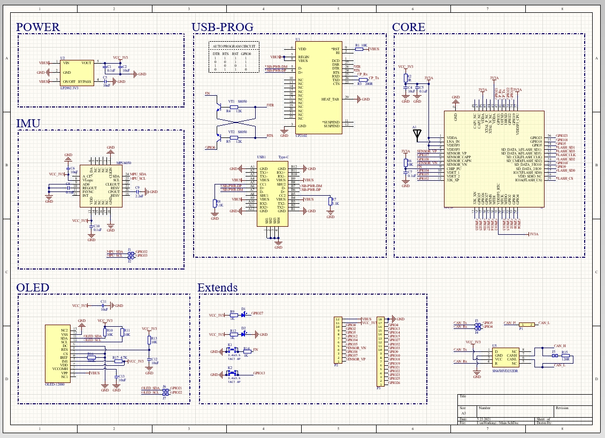

# 基于ESP32-PicoD4的开源迷你开发板
最近芯片疯狂涨价，ST系列的MCU价格已经上天，所以后面打算以ESP32为项目的主力平台。

> 实际上ESP32性能比STM32还强不少：
>
> * 双核架构，主频还高
> * 带WiFi/蓝牙能力
> * 原生基于FreeRTOS
> * GPIO-Matrix（神器，GPIO互换，PCB Layout友好度拉满）
> * 接口丰富（3个UART、2个I2C、2个SPI、**居然还带CAN**）
> * SiP封装，外围电路极其简洁

最重要的，在芯片价格涨麻了的今天，ESP32只要十多元一片，好家伙我直接推爆好吗。

同时为了方便以后做原型验证，需要用有一个评估板，看了一圈市面上并没有很满意的（连TypeC的都没几个），所以花了一下午自己设计了一个，也开源给大家。

